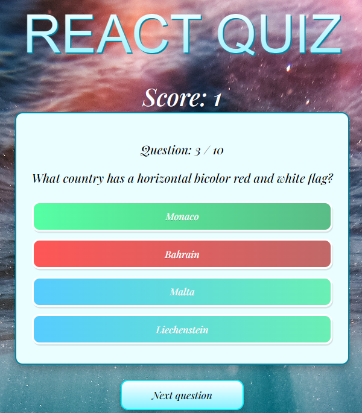

## Table of contents

- [General info](#general-info)
- [Technologies](#technologies)
- [Setup](#setup)

## General info

This project is simple quiz application.

## Technologies

Project is created with:

- TypeScript

## Setup

To run this project you just need to enter:

```
$ npm start
```

And that's it, you will have the fully working application.

